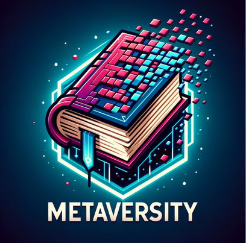
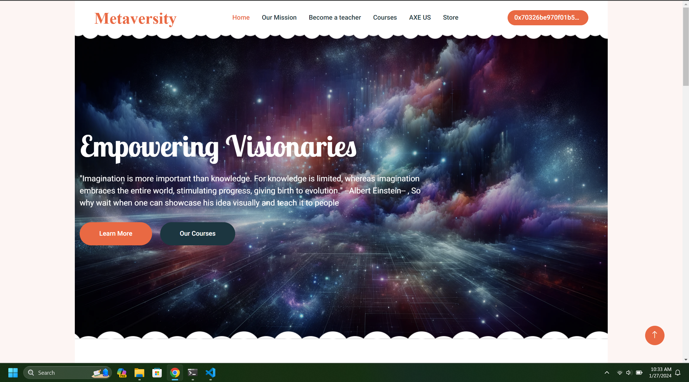

[![Contributors][contributors-shield]][contributors-url]
[![Forks][forks-shield]][forks-url]
[![Stargazers][stars-shield]][stars-url]
[![Issues][issues-shield]][issues-url]
[![MIT License][license-shield]][license-url]


<!-- PROJECT LOGO -->
<br />
<div align="center">
  <a href="https://github.com/othneildrew/Best-README-Template">
    
  </a>

  <h3 align="center">MetaVersity</h3>

  <p align="center">
    The new era of interactive and engaging education!
    <br />
    <a href="#"><strong>Explore the docs »</strong></a>
    <br />
    <br />
    <a href="#">View Demo</a>
    ·
    <a href="https://drive.google.com/file/d/1QEBaz83Jp1q44b6EBk0fE9pgwMgBSrly/view">Game Repo</a>
    ·
    <a href="https://github.com/mohamedghan/Hedera-challenge/issues">Report Bug</a>
    ·
    <a href="https://github.com/mohamedghan/Hedera-challenge/issues">Request Feature</a>
  </p>
</div>


<!-- TABLE OF CONTENTS -->
<details>
  <summary>Table of Contents</summary>
  <ol>
    <li>
      <a href="#about-the-project">About The Project</a>
      <ul>
        <li><a href="#built-with">Built With</a></li>
      </ul>
    </li>
    <li>
      <a href="#getting-started">Getting Started</a>
      <ul>
        <li><a href="#prerequisites">Prerequisites</a></li>
        <li><a href="#installation">Installation</a></li>
      </ul>
    </li>
    <li><a href="#usage">Usage</a></li>
    <li><a href="#usage">Game Repo Link</a></li>
    <li><a href="#usage">Contact Us</a></li>
  </ol>
</details>


<!-- ABOUT THE PROJECT -->
## About The Project

  <a href="https://github.com/othneildrew/Best-README-Template">
    
  </a>

In schools today, students face obstacles such as insufficient materials for practical lessons in subjects like physics and chemistry. Overcoming these challenges requires a novel approach, and thus, we suggest the utilization of blockchain technology within the metaverse to enhance educational experiences. 

Through our initiative, MetaVersity, practical sessions cover a range of subjects, including physics, chemistry, medicine, music, and mechanics, transforming even traditional subjects like history into immersive experiences — imagine reliving history in a 3D terrain. This not only addresses the scarcity of materials but also mitigates concerns about damage or misuse.

By combining the metaverse and cryptocurrency, MetaVersity aims to democratize access to practical sessions, transcending age and background barriers. This idea could change how we teach and learn, making education more interactive and exciting for everyone.
<p align="right">(<a href="#readme-top">back to top</a>)</p>


### Built With
* [![React][React.js]][React-url]
* [![Angular][express.js]][express-url]

<p align="right">(<a href="#readme-top">back to top</a>)</p>


<!-- GETTING STARTED -->
## Getting Started

To get started 

### Prerequisites

you should have a working Node.js with npm and tsc compiler
* npm
```sh
git clone https://github.com/mohamedghan/Hedera-challenge.git
cd Hedera-ch-repo
npm i 
cd server
npm i
npm i -g tsc
# launch backend (for powershell users)
tsc; node .\dist\index.js
# launch backend (for CMD users)
tsc && node .\dist\index.js
# launch frontend dev server
cd ..
npm run dev
```
to login there are two accounts in database:
<strong>username: mohamed ; password: a<br>
username: chater; password: b
</strong>
<!-- LICENSE -->
## License

Distributed under the MIT License. See `LICENSE.txt` for more information.

<p align="right">(<a href="#readme-top">back to top</a>)</p>

<!-- Game Repo Link -->
## Game Repo Link

<a href="https://drive.google.com/file/d/1QEBaz83Jp1q44b6EBk0fE9pgwMgBSrly/view">Click here to go to the unity game repository (Google drive)</a>

<p align="right">(<a href="#readme-top">back to top</a>)</p>


<!-- CONTACT -->
## Contact

Mohamed Ghanmi - [@mohamed_ghanmi](https://www.linkedin.com/in/mohamed-ghanmi/) - mohamed.ghanmi@supcom.tn<br>

Chater Marzougui - [@chater_marzougui](https://www.linkedin.com/in/chater-marzougui-342125299/) - chater.marzougui@supcom.tn<br>

Mohamed Bachir Bouaziz - [@med_bachir_bouaziz](https://www.linkedin.com/in/med-bachir-bouaziz-34065b2a5/) - mohamedbachir.bouaziz@supcom.tn<br>

Ghassen Fatnassi - [@chater_marzougui](https://www.linkedin.com/in/ghassen-fatnassi-70ab52283/) - ghassen.fatnassi@supcom.tn


<p align="right">(<a href="#readme-top">back to top</a>)</p>


<!-- MARKDOWN LINKS & IMAGES -->
<!-- https://www.markdownguide.org/basic-syntax/#reference-style-links -->
[contributors-shield]: https://img.shields.io/github/contributors/mohamedghan/Hedera-challenge.svg?style=for-the-badge
[contributors-url]: https://github.com/mohamedghan/Hedera-challenge/graphs/contributors
[forks-shield]: https://img.shields.io/github/forks/mohamedghan/Hedera-challenge.svg?style=for-the-badge
[forks-url]: https://github.com/mohamedghan/Hedera-challenge/network/members
[stars-shield]: https://img.shields.io/github/stars/mohamedghan/Hedera-challenge.svg?style=for-the-badge
[stars-url]: https://github.com/mohamedghan/Hedera-challenge/stargazers
[issues-shield]: https://img.shields.io/github/issues/mohamedghan/Hedera-challenge.svg?style=for-the-badge
[issues-url]: https://github.com/othneildrew/Best-README-Template/issues
[license-shield]: https://img.shields.io/github/license/mohamedghan/Hedera-challenge.svg?style=for-the-badge
[license-url]: https://github.com/mohamedghan/Hedera-challenge/LICENSE.txt
[linkedin-shield]: https://img.shields.io/badge/-LinkedIn-black.svg?style=for-the-badge&logo=linkedin&colorB=555
[product-screenshot]: images/screenshot.png
[Next.js]: https://img.shields.io/badge/next.js-000000?style=for-the-badge&logo=nextdotjs&logoColor=white
[express.js]: https://img.shields.io/badge/express.js-000000?style=for-the-badge&logo=expressjs&logoColor=white
[Next-url]: https://nextjs.org/
[React.js]: https://img.shields.io/badge/React-20232A?style=for-the-badge&logo=react&logoColor=61DAFB
[React-url]: https://reactjs.org/
[express-url]: https://express.org/
[Vue.js]: https://img.shields.io/badge/Vue.js-35495E?style=for-the-badge&logo=vuedotjs&logoColor=4FC08D
[Vue-url]: https://vuejs.org/
[Angular.io]: https://img.shields.io/badge/Angular-DD0031?style=for-the-badge&logo=angular&logoColor=white
[Angular-url]: https://angular.io/
[Svelte.dev]: https://img.shields.io/badge/Svelte-4A4A55?style=for-the-badge&logo=svelte&logoColor=FF3E00
[Svelte-url]: https://svelte.dev/
[Laravel.com]: https://img.shields.io/badge/Laravel-FF2D20?style=for-the-badge&logo=laravel&logoColor=white
[Laravel-url]: https://laravel.com
[Bootstrap.com]: https://img.shields.io/badge/Bootstrap-563D7C?style=for-the-badge&logo=bootstrap&logoColor=white
[Bootstrap-url]: https://getbootstrap.com
[JQuery.com]: https://img.shields.io/badge/jQuery-0769AD?style=for-the-badge&logo=jquery&logoColor=white
[JQuery-url]: https://jquery.com 
